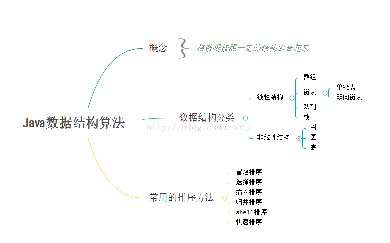

# java数据结构和算法

## 一、java数据结构算法简单图



##二、各个线性类型数据结构的特点以及使用场景##

数组：
特点：元素在内存中线性连续存储，可以根据下标快速访问数组元素，但是增删效率不是很高，每一次增加或删除元素都需要
大量移动元素空出插入位置或者填补删除元素的位置。

使用场景：频繁查询，很少进行增加或删除操作的情况

链表：
特点：存储可以不连贯，根据索引将数据联系起来，当查询元素的时候需要从开头开始去查询，所以效率比较低，然而增加或删除
元素的时候只需要修改索引就可以了。

使用场景：少查询，需要频繁插入或删除的情况

队列：
特点：先进先出(FIFO/fisrt in first out),如同一个单向隧道，先进的车先出。

使用场景：多线程的阻塞队列管理非常有用

栈：
特点：后进先出(LIFO/last in first out),就像一个箱子，先放进去的东西在底部，需要先拿出上面的东西，下面的东西才能拿出来

使用场景：实现递归以及表达式计算，android运用栈的原理实现back stack

##三、数组与链表的区别##

(1)数组连续，链表不连续
(2)数组内存静态分配，链表内存动态分配
(3)数组查询时间复杂度为O(1),链表为0(n)
(4)数组增加删除的时间复杂度为O(n),链表为O(1)
(5)数组从栈中分配空间，链表从堆中分配空间

# 算法#

## 一、常用排序##

### 1）.API排序案列

```java
package com.datastructure.test;
 
 
import java.util.Arrays;
import java.util.List;
 
 
public class ApiArray {
  public static void main(String[] args){
	  int[] a = {4,6,78,8,34,56,26};
	  sortByApi(a);
  }
  
  
/*
 * 通过api直接对数组排序
 */
  public static void sortByApi(int[] a){
	  System.out.println("排序前数组：");
	  for (int i = 0; i < a.length; i++) {
		System.out.print(a[i]+"\t");
	}
	  System.out.println();
	  Arrays.sort(a);
	  System.out.println("排序后数组：");
	  for (int i = 0; i < a.length; i++) {
		System.out.print(a[i]+"\t");
	}	  
  }
}
```

### 2)、算法排序之冒泡排序

a.两种写法，第二种方法是每一次循环比较都循环n-1次，相比于第一种方法，没那么高效。

a.1、第一种：

```java
package com.datastructure.test;
import java.util.Arrays;
import java.util.List;
 
public class ApiArray {
  public static void main(String[] args){
	  int[] a = {4,6,78,8,34,56,26,2};
	  sortByBubble(a);
  }
  /*
   * 冒泡排序
   */
    public static void sortByBubble(int[] a){
    	int temp,i,j;
  	  System.out.println("排序前数组：");
  	  for (i = 0; i < a.length; i++) {
  		System.out.print(a[i]+"\t");
  	}
  	  for (i = 1; i < a.length; i++) {
		for (j = 0; j < a.length-i; j++) {
			if (a[j]>a[j+1]) {
				temp = a[j];
				a[j] = a[j+1];
				a[j+1] = temp;
			}
		}
	}	
  	  System.out.println();
  	  System.out.println("排序后数组：");
  	  for (i = 0; i < a.length; i++) {
  		System.out.print(a[i]+"\t");
  	}	  
    }  
}
```

a.2、第二种

```java
	for (i = 1; i < a.length; i++) {
		for (j = 0; j < a.length-1; j++) {
			if (a[j]>a[j+1]) {
				temp = a[j];
				a[j] = a[j+1];
				a[j+1] = temp;
			}
		}
	}
```

