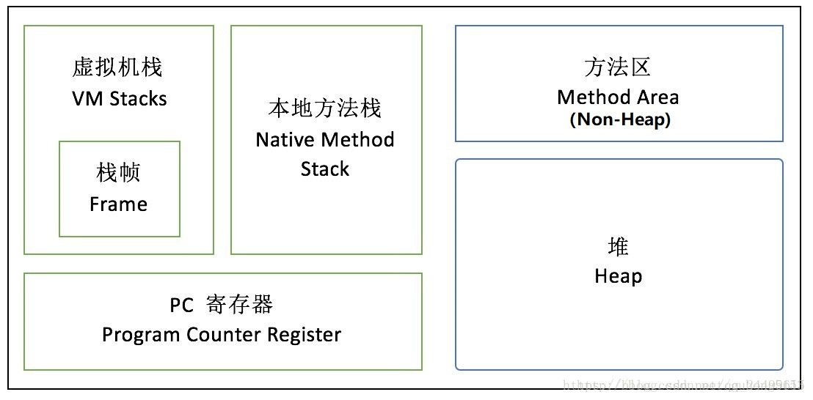
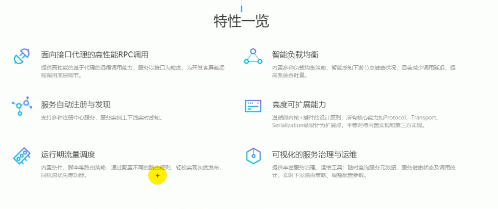

#restful风格

统一代码风格，便于团队开发，特别是前后端分离，面向接口开发

URI：  /资源名称/资源标识       HTTP请求方式区分对资源CRUD操作

get获取资源、post新建资源、put更新资源、delete删除资源

    普通CRUD（uri来区分操作）       	RestfulCRUD      
  查询  	getEmp                 						emp---GET        
  添加  	addEmp?xxx             					emp---POST       
  修改  	updateEmp?id=xxx&xxx=xx			emp/{id}---PUT   
  删除  	deleteEmp?id=1         					emp/{id}---DELETE

> 看Url就知道要什么
>
> 看http method就知道干什么
> 看http status code就知道结果如何

首先要明确一点：REST 实际上只是一种设计风格，它并不是标准。（所以你可以看到网上一大堆的各种最佳实践，设计指南，但是没有人说设计标准）。[aisuhua/restful-api-design-references ・ GitHub](https://link.zhihu.com/?target=https%3A//github.com/aisuhua/restful-api-design-references)

说说几个重要的概念：

**1、REST 是面向资源的，这个概念非常重要，而资源是通过 URI 进行暴露。**
URI 的设计只要负责把资源通过合理方式暴露出来就可以了。对资源的操作与它无关，操作是通过 HTTP动词来体现，所以REST 通过 URI 暴露资源时，会强调不要在 URI 中出现动词。

```
GET /rest/api/getDogs --> GET /rest/api/dogs 获取所有小狗狗 
GET /rest/api/addDogs --> POST /rest/api/dogs 添加一个小狗狗 
GET /rest/api/editDogs/:dog_id --> PUT /rest/api/dogs/:dog_id 修改一个小狗狗 
GET /rest/api/deleteDogs/:dog_id --> DELETE /rest/api/dogs/:dog_id 删除一个小狗狗 
```

左边的这种设计，很明显不符合REST风格，上面已经说了，URI 只负责准确无误的暴露资源，而 getDogs/addDogs...已经包含了对资源的操作，这是不对的。相反右边却满足了，它的操作是使用标准的HTTP动词来体现。

**2、REST很好地利用了HTTP本身就有的一些特征，如HTTP动词、HTTP状态码、HTTP报头等等**
REST API 是基于 HTTP的，所以你的API应该去使用 HTTP的一些标准。这样所有的HTTP客户端（如浏览器）才能够直接理解你的API（当然还有其他好处，如利于缓存等等）。REST 实际上也非常强调应该利用好 HTTP本来就有的特征，而不是只把 HTTP当成一个传输层这么简单了。

HTTP动词

```
GET     获取一个资源 
POST    添加一个资源 
PUT     修改一个资源 
DELETE  删除一个资源 
```

实际上，这四个动词实际上就对应着增删改查四个操作，这就利用了HTTP动词来表示对资源的操作。

HTTP状态码

```
200 OK 
400 Bad Request 
500 Internal Server Error
```

- 所有事情都按预期正确执行完毕 - 成功
- APP 发生了一些错误 �C 客户端错误
- API 发生了一些错误 �C 服务器端错误

这三种状态与上面的状态码是一一对应的。

HTTP报头

```
Authorization 认证报头 
Cache-Control 缓存报头 
Cnotent-Type  消息体类型报头 
......
```

报头还有很多，不一一列举。HTTP报头是描述HTTP请求或响应的元数据，它的作用是客户端 与 服务器端进行相互通信时，告诉对方应该如何处理本次请求。

**3、超媒体**
老实说，这个词汇我到目前还有没搞得全懂。那也说说自己的理解吧，不一定准确哦，有错误希望指出。
”超媒体“ 你没听说过没关系，”超链接“ 你一定不会陌生。简单来说，”超链接“ 是实现超媒体中的一种方式。”超媒体“希望达到一种就是说在 REST API 中把所有资源给链接起来。它就犹如你打开一个网站的首页，你难道看到的只有首页吗？NO !, 不是的，你可以通过首页查看商品、查看文章、查看论坛。”超媒体“ 就是做这个事情，它利用 API 把所有资源的关系给链接起来了，你看到不会只是一个独立的资源，而是关系网中的一个资源。
”超媒体“ 有点高大上了，老实说，就算你够牛X，写出了一个非常棒的符合”超媒体“的REST API，你的用户即开发者，也不一定能够接受你这种高大上的设计。当然，我相信未来也许可以普及了。


#java-base#

## java对象生命周期##

1.创建阶段(Created)

2.应用阶段(In Use)

3.不可见阶段(Invisible)

4.不可达阶段(Unreachable)

5.收集阶段(Collected)

6.终结阶段(Finalized)

7.对象空间重分配阶段(De-allocated)

具体查看：<https://blog.csdn.net/sodino/article/details/38387049>


## 成员变量和局部变量的区别

1 在类中位置不同：成员变量：在类中方法外。局部变量：在方法定义中或者方法声明上。
2 在内存中的位置不同：成员变量：在堆内存。  局部变量：在栈内存。
3 生命周期不同：成员变量：随着对象的创建而存在，随着对象的消失而消失。局部变量：随着方法的调用而存在，随着方法的调用完毕而消失。

4 初始化值不同：成员变量：有默认值初始化。局部变量：没有默认值初始化，必须定义，赋值，然后才能使用。5 注意事项：局部变量名称可以和成员变量名称一样，在方法中使用的时候，采用的是就近原则

（如果局部变量的名字和成员变量的名字相同， 要想在该方法中使用成员变量，必须使用关键字this）

## 成员变量和类变量的区别：

1、两个变量的生命周期不同
?      成员变量随着对象的创建而存在，随着对象的回收而释放。
?      静态变量随着类的加载而存在，随着类的消失而消失。
2、调用方式不同
?      成员变量只能被对象调用。
?      静态变量可以被对象调用，还可以被类名调用。
3、别名不同
?      成员变量也称为实例变量。
?      静态变量也称为类变量。
4、数据存储位置不同
 	成员变量存储在堆内存的对象中，所以也叫对象的特有数据。
 	静态变量数据存储在方法区（共享数据区）的静态区，所以也叫对象的共享数据。
（在jdk8之前，静态成员变量确实是存在在方法区的，但是在jdk8后，取消了“永久代”，取而代之的是“元空间”，
元空间不再使用虚拟内存而是本地内存进行存储，永久代的数据也进行了相关迁移，
常量池和静态成员变量都放到了堆里进行存储）

##forward(转发)redirect(重定向)的区别##

区别：

地址栏：

?	forward为服务器的直接跳转，客户端浏览器并不知道，地址栏内容不变（服务器内部的动作）

?	redirect为客户端浏览器根据URL地址重新向服务器请求，地址栏变（有可能是请求的URI地址发生变化）

数据共享：

?	forward共享浏览器传来的request

?	 redirect全新的request （这是服务器会向客户端发送302 状态码和新的url 301代表永久性转移 302代表暂时性转移）

运用的地方：forward用户登录后根据角色跳转页面     		(服务器处理两次)

?        		redirect在用户注销后跳转主页或其他页面	（两次请求）

效率：1比2少了一次服务器请求，效率高一些

# java内存#

问题：

- **介绍下Java内存区域（运行时数据区）。**
- **Java对象的创建过程（五步，建议能默写出来并且要知道每一步虚拟机做了什么）**
- **对象的访问定位的两种方式（句柄和直接指针两种方式）**

**拓展问题:**

- **String类和常量池**
- **8种基本类型的包装类和常量池**

## java内存区域（运行时数据区）



**线程私有**的：

虚拟机栈、本地方法栈、程序计数器（pc寄存器）

**线程共享**的：

堆、方法区、*直接内存*

**1.程序计数器**

程序计数器是一块**较小**的内存空间，可以看作是**当前线程所执行的字节码的行号指示器**。字节码解释器工作时通过改变这个计数器的值来选取下一条需要执行的字节码指令，分支、循环、跳转、异常处理、线程恢复等功能都需要依赖这个计数器来完。

另外，为了线程切换后能恢复到正确的执行位置，每条线程都需要有一个**独立的程序计数器**，各线程之间计数器互不影响，独立存储，我们称这类内存区域为“线程私有”的内存。

**2.java虚拟机栈**

与程序计数器一样，Java虚拟机栈也是线程私有的，它的生命周期和线程相同，描述的是Java方法执行的内存模型。

Java内存可以**粗糙的区分为堆内存（Heap）和栈内存(Stack),**其中栈就是现在说的虚拟机栈，或者说是**虚拟机栈中局部变量表部分**。

**局部变量表主要存放了编译器可知的各种数据类型**（boolean、byte、char、short、int、float、long、double）、**对象引用**（reference类型，它不同于对象本身，可能是一个指向对象起始地址的引用指针，也可能是指向一个代表对象的句柄或其他与此对象相关的位置）。

**3.本地方法栈**

和虚拟机栈所发挥的作用非常相似，区别是： **虚拟机栈为虚拟机执行Java方法 （也就是字节码）服务，而本地方法栈则为虚拟机使用到的Native方法服务。** 在HotSpot虚拟机中和Java虚拟机栈合二为一。

**4.堆**

Java虚拟机所管理的内存中最大的一块，Java堆是所有线程共享的一块内存区域，在虚拟机启动时创建。此内存区域的唯一目的就是**存放对象实例**，**几乎所有的对象实例以及数组都在这里分配内存**。

Java堆是垃圾收集器管理的主要区域，因此也被称作**GC堆（Garbage Collected Heap）**.从垃圾回收的角度，由于现在收集器基本都采用分代垃圾收集算法，所以Java堆还可以细分为：新生代和老年代：在细致一点有：Eden空间、From Survivor、To Survivor空间等。**进一步划分的目的是更好地回收内存，或者更快地分配内存。**

**5.方法区**

方法区与 Java 堆一样，是各个线程共享的内存区域，它用于**存储已被虚拟机加载的类信息、常量、静态变量**、**即时编译器编译后的代码等数据**。虽然Java虚拟机规范把方法区描述为堆的一个逻辑部分，但是它却有一个别名叫做 Non-Heap（非堆），目的应该是与 Java 堆区分开来。

HotSpot虚拟机中方法区也常被称为 **“永久代”**，本质上两者并不等价。仅仅是因为HotSpot虚拟机设计团队用永久代来实现方法区而已，这样HotSpot虚拟机的垃圾收集器就可以像管理Java堆一样管理这部分内存了。但是这并不是一个好主意，因为这样更容易遇到内存溢出问题。

相对而言，垃圾收集行为在这个区域是比较少出现的，但并非数据进入方法区后就“永久存在”了。

**5.1.运行时常量池**

运行时常量池是方法区的一部分。Class 文件中除了有类的版本、字段、方法、接口等描述信息外，还有常量池信息（用于存放编译期生成的各种字面量和符号引用）

既然运行时常量池时方法区的一部分，自然受到方法区内存的限制，当常量池无法再申请到内存时会抛出 **OutOfMemoryError** 异常。

**JDK1.7及之后版本的 JVM 已经将运行时常量池从方法区中移了出来，在 Java 堆（Heap）中开辟了一块区域存放运行时常量池。同时在 jdk 1.8中移除整个永久代，取而代之的是一个叫元空间（Metaspace）的区域**

元空间的本质和永久代类似，都是对JVM规范中方法区的实现。不过**元空间与永久代之间最大的区别在于：元空间并不在虚拟机中，而是使用本地内存。**

**推荐阅读：**

- 《Java中几种常量池的区分》：https://blog.csdn.net/qq_26222859/article/details/73135660
- 《Java8内存模型―永久代(PermGen)和元空间(Metaspace)》：http://www.cnblogs.com/paddix/p/5309550.html

**6.直接内存**

直接内存并不是虚拟机运行时数据区的一部分，也不是虚拟机规范中定义的内存区域，但是这部分内存也被频繁地使用。而且也可能导致OutOfMemoryError异常出现。

JDK1.4中新加入的**NIO(New Input/Output)类**，引入了一种基于**通道（Channel）**与**缓存区（Buffer）** 的I/O方式，它可以直接使用Native函数库直接分配堆外内存，然后通过一个存储在java堆中的DirectByteBuffer对象作为这块内存的引用进行操作。这样就能在一些场景中显著提高性能，因为**避免了在Java堆和Native堆之间来回复制数据**。

本机直接内存的分配不会收到Java堆的限制，但是，既然是内存就会受到本机总内存大小以及处理器寻址空间的限制。


# 线程#

## 线程调度

ja线程的调度采用占先原则,优先级越高的线程越优先执行.每个JAVA线程优先级有设置在常数1-10的范围,默认值是5.但优先级高并不代表能独自占用执行时间片，而是优先级越高得到越多的执行时间片，反之，优先级低的分到的执行时间少但不会分配不到执行时间。

在Java多线程环境中，为保证所有线程的执行能按照一定的规则执行，**JVM实现了一个线程调度器**，它定义了线程调度的策略，对于CPU运算的分配都进行了规定，按照这些特定的机制为多个线程分配CPU的使用权。

  **一般线程调度模式分为两种――抢占式调度和协同式调度。**

**抢占式调度:**指的是每条线程执行的时间、线程的切换都由系统控制，系统控制指的是在系统某种运行机制下，可能每条线程都分同样的执行时间片，也可能是某些线程执行的时间片较长，甚至某些线程得不到执行的时间片。在这种机制下，一个线程的堵塞不会导致整个进程堵塞。

**协同式调度:**指某一线程执行完后主动通知系统切换到另一线程上执行，这种模式就像接力赛一样，一个人跑完自己的路程就把接力棒交接给下一个人，下个人继续往下跑。线程的执行时间由线程本身控制，线程切换可以预知，不存在多线程同步问题，但它有一个致命弱点：如果一个线程编写有问题，运行到一半就一直堵塞，那么可能导致整个系统崩溃。

## 线程池数的算法

**根据CPU核心数确定线程池并发线程数**

Nthreads=Ncpu*Ucpu*(1+w/c)，其中

Ncpu=CPU核心数

Ucpu=cpu使用率，0~1

W/C=等待时间与计算时间的比率


**IO密集型**=2Ncpu（可以测试后自己控制大小，2Ncpu一般没问题）（常出现于线程中：数据库数据交互、文件上传下载、网络数据传输等等）

**计算密集型**=Ncpu（常出现于线程中：复杂算法）

**java中：Ncpu=Runtime.getRuntime().availableProcessors()**

**具体查看：**<https://www.cnblogs.com/dennyzhangdd/p/6909771.html>


# Spring

## Spring事务配置##

Spring它对JDBC的隔离级别作出了补充和扩展，其提供了7种事务传播行为。（通俗解释原址）

?    1、PROPAGATION_REQUIRED：默认事务类型，如果没有，就新建一个事务；如果有，就加入当前事务。适合绝大多数情况。

?    2、PROPAGATION_REQUIRES_NEW：如果没有，就新建一个事务；如果有，就将当前事务挂起。

?    3、PROPAGATION_NESTED：如果没有，就新建一个事务；如果有，就在当前事务中嵌套其他事务。

?    4、PROPAGATION_SUPPORTS：如果没有，就以非事务方式执行；如果有，就使用当前事务。

?    5、PROPAGATION_NOT_SUPPORTED：如果没有，就以非事务方式执行；如果有，就将当前事务挂起。即无论如何不支持事务。

?    6、PROPAGATION_NEVER：如果没有，就以非事务方式执行；如果有，就抛出异常。

?    7、PROPAGATION_MANDATORY：如果没有，就抛出异常；如果有，就使用当前事务。

 **REQUIRED**：支持当前事务，如果当前没有事务，就新建一个事务。这是最常见的选择。?

?**SUPPORTS**：支持当前事务，如果当前没有事务，就以非事务方式执行。?

?**MANDATORY**：支持当前事务，如果当前没有事务，就抛出异常。?

?**REQUIRES_NEW**：新建事务，如果当前存在事务，把当前事务挂起。?

?**NOT_SUPPORTED**：以非事务方式执行操作，如果当前存在事务，就把当前事务挂起。?

?**NEVER**：以非事务方式执行，如果当前存在事务，则抛出异常。?

**NESTED**：支持当前事务，如果当前事务存在，则执行一个嵌套事务，如果当前没有事务，就新建一个事务。?

作者：sayok_why 
来源：CSDN 
原文：https://blog.csdn.net/sayoko06/article/details/79164858 
版权声明：本文为博主原创文章，转载请附上博文链接！

```xml
<?xml version="1.0" encoding="UTF-8"?>
<beans xmlns="http://www.springframework.org/schema/beans"
	xmlns:context="http://www.springframework.org/schema/context" xmlns:p="http://www.springframework.org/schema/p"
	xmlns:aop="http://www.springframework.org/schema/aop" xmlns:tx="http://www.springframework.org/schema/tx"
	xmlns:xsi="http://www.w3.org/2001/XMLSchema-instance"
	xsi:schemaLocation="http://www.springframework.org/schema/beans http://www.springframework.org/schema/beans/spring-beans-4.0.xsd
	http://www.springframework.org/schema/context http://www.springframework.org/schema/context/spring-context-4.0.xsd
	http://www.springframework.org/schema/aop http://www.springframework.org/schema/aop/spring-aop-4.0.xsd http://www.springframework.org/schema/tx http://www.springframework.org/schema/tx/spring-tx-4.0.xsd
	http://www.springframework.org/schema/util http://www.springframework.org/schema/util/spring-util-4.0.xsd">

	<!-- 事务管理器 -->
	<bean id="transactionManager"
		class="org.springframework.jdbc.datasource.DataSourceTransactionManager">
		<!-- 数据源 -->
		<property name="dataSource" ref="dataSource" />
	</bean>
	<!-- 通知 -->
	<tx:advice id="txAdvice" transaction-manager="transactionManager">
		<tx:attributes>
			<!-- 传播行为 -->
          	<tx:method name="save*" propagation="REQUIRED" />
			<tx:method name="insert*" propagation="REQUIRED" />
			<tx:method name="add*" propagation="REQUIRED" />
			<tx:method name="create*" propagation="REQUIRED" />
			<tx:method name="delete*" propagation="REQUIRED" />
			<tx:method name="update*" propagation="REQUIRED" />
			<tx:method name="find*" propagation="SUPPORTS" read-only="true" />
			<tx:method name="select*" propagation="SUPPORTS" read-only="true" />
			<tx:method name="get*" propagation="SUPPORTS" read-only="true" />
		</tx:attributes>
	</tx:advice>
	<!-- 切面 -->
	<aop:config>
		<aop:advisor advice-ref="txAdvice"
			pointcut="execution(* com.taotao.service.*.*(..))" />
	</aop:config>
</beans>
```

可查看：<https://blog.csdn.net/albertfly/article/details/52681993>


**spring本质就是一个容器：有三个技术组成IOC(DI),AOP,MVC。**

> IOC(Inversion of Control)：
> 其思想是反转资源获取的方向. 传统的资源查找方式要求组件向容器发起请求查找资源. 作为回应, 容器适时的返回资源. 
> 而应用了 IOC 之后, 则是容器主动地将资源推送给它所管理的组件, 组件所要做的仅是选择一种合适的方式来接受资源. 
> 这种行为也被称为查找的被动形式
> DI(Dependency Injection) ― IOC 的另一种表述方式：
> 即组件以一些预先定义好的方式(例如: setter 方法)接受来自如容器的资源注入. 相对于 IOC 而言，这种表述更直接

## IOC:

控制反转，作用是创建对象，管理对象的生命周期，维护对象的关系。由原来的对象依赖对象变为对象依赖容器。
2.1.1 创建对象：以前是我们在java代码new的方式创建对象，现在就交给spring管理，直接在spring的配置文件<bean id="car",class="com.rshz.entity.car">。
2.1.2：spring创建了对象，我们如果得到对象呢：
①得到IOC容器:
ApplicationContext ctx=new ClassPathXmlApplicationContext("ApplicationContext.xml")；
②得到bean:ctx.getBean("car");
③spring集合springmvc以后，直接用注解@AutoWired就可以得到对象bean了。

2.2.1 管理对象的生命周期：分为单例模式（如何实现单例模式：先将构造方法私有化，再创建公共静态的访问方法）；非单例模式。

2.2.2 IOC默认是**单例模式**，在你还没有实例对象时，程序在启动的时候就会创建一个对象，以后无论实例多少次，都只能得到这一个对象。而非单例模式（prototype，也称原型模式）是在你实例的时候才创建对象，而且你实例多少次就创建多少个对象。

2.3.1 维护对象关系：比如某一个对象的属性是另一个对象，这种关系也交给spring容器管理。有一对多的关系时（一个部门有多个员工）：在一的一方的xml文件配置一个<collection>;有多对一时（多个员工属于一个部门）：在多的一方的xml文件配置一个<association>。

## AOP

1.1 AOP:面向切面编程。把公共的问题写在切面编程上，这样我们就可以专注于我们的业务逻辑就可以了。
1.1.1 如何实现AOP：①定义切面编程类：实现事先切入(MethedBeforAdvice),事后切入（afterReturnAdvice）,环绕切入，异常切入（throwsAdvice）等接口。②定义接口，在接口定义一个方法。③定义接口的实现类 ④通过spring  ProxyFactoryBean的代理工厂创建对象：<!-- aop实现 -->
```xml
<bean id="adv" class="com.spring.aop.Advice"></bean>
<bean id="aqiPlay" class="com.spring.aop.AQIPlay"></bean>
<!-- 代理工厂 -->
<bean id="play" class="org.springframework.aop.framework.ProxyFactoryBean">
	<property name="proxyInterfaces">
		<value>com.spring.aop.Play</value>
	</property>
	<property name="interceptorNames">
		<list>
			<value>adv</value>
		</list>
	</property>
	<property name="target" ref="aqiPlay" />
</bean>。
```

# SpringMVC#

1.1 MVC:也是一种思想，MVC的框架有springMVC，strut1，strut2。

1.2 MVC把项目分为视图层（页面展示，相当于jsp），控制层（相当于servlet，负责请求转发，把请求转给模型层，把处理结果转给视图层），模型层（相当于dao层，做业务逻辑和数据库操作）分开设计，便于项目分工。提高代码的重用性，简化客户的请求和响应。

## SpringMVC处理流程##

> springMVC如何处理流程：用户发送的请求首先被核心控制器（dispatchservlet）拦截，再根据发来的URL分发给具体的处理器（handler）处理，业务逻辑处理完返回一个modelAndView给视图解析器，视图解析器解析，拼接前后缀，视图渲染，再返回给dispatchservlet，流程结束。


# Mybatis#


```xml
<resultMap id="BaseResultMap" type="com.taotao.pojo.TbContentCategory" >
	<id column="id" property="id" jdbcType="BIGINT" />
	<result column="parent_id" property="parentId" jdbcType="BIGINT" />
	<result column="name" property="name" jdbcType="VARCHAR" />
	<result column="status" property="status" jdbcType="INTEGER" />
	<result column="sort_order" property="sortOrder" jdbcType="INTEGER" />
	<result column="is_parent" property="isParent" jdbcType="BIT" />
	<result column="created" property="created" jdbcType="TIMESTAMP" />
	<result column="updated" property="updated" jdbcType="TIMESTAMP" />
</resultMap>
```


# 服务器#

**web服务器**：tomcat（项目开发阶段都是用的tomcat），weblogic（项目发布一般用这个服务器，性能较好，但是收费的），webspare,jboss。

## tomcat##

**tomcat**实际上就是一个serversocket,再加上多线程，反射机制，xml技术等等。tomcat有两个对象：request和response。servlet写的response和request就是tomcat的。


## apache和tomcat的区别##

我觉得要理解apache(httpd)和tomcat的区别，关键是要理解静态页面和动态页面到底是什么东东。
浏览器呈现给人的东西，只能是html页面加上css样式表的效果，当然还有图片视频之类的资源。这是在浏览器上的真正内容。
但是要生成这些内容，就有了静态页面和动态页面的区别。apache只能把静态的内容发送到浏览器，而不能动态生成这些内容。而Java(servlet)则是其中一种生成动态页面的手段。Tomcat就是这种java应用程序的运行环境。你可以直接用tomcat作为web服务器，来发送html页面，同时在其中运行java来动态生成页面，也可以加上apache在中间，作为对动态页面请求的代理者。

>  Nginx/apache 可以说是web server.  tomcat不止是web server 还是servlet容器，管理整个Servlet的生命周期。而GlassFish/Weblogic这一类的 application Server，则会管理更多，包含命名服务器，EJB等资源。

**Apache**是web服务器（静态解析，如HTML），

**tomcat**是java应用服务器（动态解析，如JSP）Tomcat只是一个servlet(jsp也翻译成servlet)容器，可以认为是apache的扩展，但是可以独立于apache运行。

动静分离，Apache（c语言）/（或者nginx）做静态资源的服务器，tomcat做动态资源的服务器。由tomcat解析动态页面，apache做动态页面请求代理。

**Apache HTTP Server**和**Nginx**本身不支持生成动态页面，但它们可以通过**其他模块**来支持（例如通过Shell、PHP、Python脚本程序来动态生成内容）。

**Nginx**优点：负载均衡、反向代理、处理静态文件优势。nginx处理静态请求的速度高于apache；

**Apache**优点：相对于Tomcat服务器来说处理静态文件是它的优势，速度快。Apache是静态解析，适合静态**HTML**、图片等。

**Tomcat**：动态解析容器，处理动态请求，是编译JSP\Servlet的容器，Nginx有动态分离机制，静态请求直接就可以通过Nginx处理，动态请求才转发请求到后台交由Tomcat进行处理。

**Apache**在处理动态有优势，Nginx并发性比较好，CPU内存占用低，如果rewrite频繁，那还是Apache较适合。

**1 鉴权**

主要是http鉴权（basic模式），数据来源是ldap。http鉴权有basic和digest（摘要）鉴权，我只见过basic鉴权的，建议每个人都去了解一下协议和如何配置，其实也相当简单，花不了多少时间。

知识点：http鉴权（basic模式），LDAP

PS：tomcat也可以配置http鉴权。

**2. 负载均衡**

常规用处，没啥好说，找文档配置一下就知道。

**3. 处理静态文件**

最常规的功能。静态文件直接处理（一般加上缓存头），其他转给tomcat，用ajp协议（apache专用协议，nginx也有，但没有在ng上用过ajp转发）。

知识点：ajp协议，页面缓存相关知识

**4 反向代理**

重要的功能，现在用得越来越多了。用于做请求分发，解决ajax跨域调用。

知识点：ajax跨域

**5 页面缓存**

包括给静态文件返回缓存相关的头，和配置缓存模块。这是2个不同东西。

知识点：浏览器如何缓存资源

## other##

**服务器内存溢出**：以tomcat为例，找到bin目录的catalina.bat，打开catalina.bat最前面加入set JAVA_OPTS=-Xms128m-Xmx350m

# 数据库（database）#

## Mysql

图解MySQL 内连接、外连接、左连接、右连接、全连接<https://blog.csdn.net/plg17/article/details/78758593>

| 名称      | 描述                          | 关键字        |
| ------- | --------------------------- | ---------- |
| 内连接     | 返回交集                        | inner join |
| 外连接-左连接 | 左表全显示，右表返回符合要求的数据(没值补null)  | left join  |
| 外连接-右连接 | 右表全显示，左表返回要求都需要的数据(没值补null) | right join |
| 全连接     | mysql暂时不支持                  |            |

### sql的执行顺序###

1. **FROM：**对FROM子句中的前两个表执行笛卡尔积（Cartesian product)(交叉联接），生成虚拟表VT1
2. **ON：**对VT1应用ON筛选器。只有那些使<join_condition>为真的行才被插入VT2。
3. **OUTER(JOIN)：**如 果指定了OUTER JOIN（相对于CROSS JOIN 或(INNER JOIN),保留表（preserved table：左外部联接把左表标记为保留表，右外部联接把右表标记为保留表，完全外部联接把两个表都标记为保留表）中未找到匹配的行将作为外部行添加到 VT2,生成VT3.如果FROM子句包含两个以上的表，则对上一个联接生成的结果表和下一个表重复执行步骤1到步骤3，直到处理完所有的表为止。
4. **WHERE：**对VT3应用WHERE筛选器。只有使<where_condition>为true的行才被插入VT4.
5. **GROUP BY：**按GROUP BY子句中的列列表对VT4中的行分组，生成VT5.
6. **CUBE|ROLLUP：**把超组(Suppergroups)插入VT5,生成VT6.
7. **HAVING：**对VT6应用HAVING筛选器。只有使<having_condition>为true的组才会被插入VT7.
8. **SELECT：**处理SELECT列表，产生VT8.
9. **DISTINCT：**将重复的行从VT8中移除，产生VT9.
10. **ORDER BY：**将VT9中的行按ORDER BY 子句中的列列表排序，生成游标（VC10).
11. **TOP：**从VC10的开始处选择指定数量或比例的行，生成表VT11,并返回调用者。

## 缓存##

> 一级缓存：session，安全。二级缓存：sessionfactory：不安全，因为共享。


 ## Nosql##

### redis###

> 为什么要使用缓存呢？ 对于经常要读取，但是又很少变化的数据请存进缓存，以防止频繁读取数据库导致系统性能下降。 数据更新后，先调用删除方法，再调用写入方法更新缓存。
>
> redis数据类型：String/hash/list/set/zset.

#### 缓存遇到的问题：

**缓存穿透**： 

?	1：对查询结果为空的情况也进行缓存，缓存时间设置短一点，或者该key对应的数据insert了之后清理缓存。

?	2：对不可能存在的key进行过滤。

**缓存雪崩：**

?	概念:大量的key设置了相同的过期时间，导致在缓存在同一时刻全部失效，造成瞬时DB请求量大、压力骤增，引起雪崩。

1：在缓存失效后，通过加锁或者队列来控制读数据库写缓存的线程数量。比如对某个key只允许一个线程查	询数据和写缓存，其他线程等待。

2：不同的key，设置不同的过期时间，让缓存失效的时间点尽量均匀。

3：做二级缓存，A1为原始缓存，A2为拷贝缓存，A1失效时，可以访问A2，A1缓存失效时间设置为短期，A2设置为长期（此点为补充）

做缓存一帮分为页面缓存和数据缓存。redis一般为数据缓存

#### 一.redis做页面缓存

?	第一次从数据库读取，然后生成一个静态页面，以后所有读取，就加载这个静态页面就可以了。

#### 二.做数据缓存

数据不会频繁变化的数据做缓存。（string set get(普通缓存)/hash hset/hget)

数据缓存经常会用在页面的具体数据里面。（由于一个页面有从好几种需要从不同的缓存中读取数据的模块，所以不适合使用页面缓存（eg：首页中的文化场所（场所的名称、地址、类别、详细介绍等!）、文化活动、地域文化(需要从不同的缓存(key)中读取数据模，因而做数据缓存，而不能做页面缓存））。

#### 三.其它介绍：

J2Cache 是 OSChina 目前正在使用的两级缓存框架。第一级缓存使用 [Ehcache](http://www.oschina.net/p/ehcache)，第二级缓存使用 [Redis](http://www.oschina.net/p/redis) 。由于大量的缓存读取会导致 L2 的网络成为整个系统的瓶颈，因此 L1 的目标是降低对 L2 的读取次数。该缓存框架主要用于集群环境中。单机也可使用，用于避免应用重启导致的 Ehcache 缓存数据丢失。

Ehcache  内存+磁盘。是一个纯Java的进程内缓存框架，具有快速、精干等特点，是Hibernate中默认的CacheProvider。

#### 四.大致介绍：

用户查询的时候看一级缓存里有没有对应的key(即Ehcache ),如果没有就去二级缓存redis中找（是否需要存入一级缓存），如果没有去数据库找（是否需要存入一级缓存----->二级缓存）

J2Cache 的两级缓存结构

L1： 进程内缓存(caffeine\ehcache)
L2： Redis/Memcached 集中式缓存

# 分布式

## 如何理解分布式、负载均衡、集群。

  分布式是指将不同的业务分布在不同的地方，集群指的是将几台服务器集中在一起，实现同一业务。在现有网络结构之上，
  负载均衡提供了一种廉价有效的方法扩展服务器带宽和增加吞吐量，加强网络数据处理能力，提高网络的灵活性和可用性。

## dubbo

 	### 简介

dubbo是一个RPC（远程过程调用Remote Procedure Call）框架，

[官方文档：](http://dubbo.apache.org/zh-cn/docs/user/quick-start.html)<http://dubbo.apache.org/zh-cn/docs/user/quick-start.html>



### 环境搭建：

**注册中心：**

[zookeeper:](http://dubbo.apache.org/zh-cn/docs/user/references/registry/zookeeper.html)<http://dubbo.apache.org/zh-cn/docs/user/references/registry/zookeeper.html>

**管理控制台**

安装：

```clike
git clone https://github.com/apache/dubbo.git
cd dubbo
运行 dubbo-demo-provider中的org.apache.dubbo.demo.provider.Provider
如果使用Intellij Idea 请加上-Djava.net.preferIPv4Stack=true
  
修改：
resource/META-INFO.spring/dubbo-demo-provider.xml
修改其中的dubbo:registry，替换成真实的注册中心地址，推荐使用zookeeper

```

**监控中心**（简易的监控中心）

### 笔记

 	A.把接口，bean提取到一个公共的服务中（项目），具体服务（项目）只写实现（依赖接口服务（项目））。

?	B.  1.将服务提供者注册到注册中心；（暴露服务）

?			a.导入依赖（dubbo的依赖，（SpringBoot dubbo的start））

?		        b.dubbo的其它依赖（如zookeeper的依赖）

?	     2.让消费者去注册中心订阅服务提供者的服务地址。

?	

# jsp相关

**JSP所支持的九大隐含对象：**

request 		HttpServletRequest类的实例

response       HttpServletResponse类的实例

out 		        PrintWriter类的实例，用于把结果输出至网页上
session		HttpSession类的实例
application	ServletContext类的实例，与应用上下文有关
config		ServletConfig类的实例
pageContext	PageContext类的实例，提供对JSP页面所有对象以及命名空间的访问
page  		类似于Java类中的this关键字
Exception	Exception类的对象，代表发生错误的JSP页面中对应的异常对象

**JSP的四个作用域**

application	  在所有应用程序中有效
session		  在当前会话中有效
request		  在当前请求中有效

page		  在当前页面有效

# 前端知识总结#

##块级元素和行内元素##

**块级元素**

特点：1.每个块级元素都是独自占一行，其后的元素也只能另起一行，并不能两个元素共用一行。

　　　2.元素的高度、宽度、行高和顶底边距都是可以设置的。　　

　　　3.元素的宽度如果不设置的话，默认为父元素的宽度。

常见的块级元素：**<div>、<p>、<h1>...<h6>、<ol>、<ul>、<dl>、<table>、<address>、<blockquote> 、<form>**

**行级元素**

特点：1.可以和其他元素处于一行，不用必须另起一行。

　　　2.元素的高度、宽度及顶部和底部边距不可设置。

　　　3.元素的宽度就是它包含的文字、图片的宽度，不可改变。

常见的行级元素：**<span>、<input>、<select>**

二者可以互换：display:inline/block将元素设置为行级/块级元素。

## 选择器##

id选择器：#id-name。

class选择器：.class-name。

**jquery**

jQuery 选择器基于元素的 id、类、类型、属性、属性值等"查找"（或选择）HTML 元素。 它基于已经存在的 [CSS 选择器](https://www.runoob.com/cssref/css-selectors.html)，除此之外，它还有一些自定义的选择器。**jQuery 中所有选择器都以美元符号开头：$()。**

## jquery事件##

常见 DOM 事件：

| 键盘事件             | 鼠标事件               | 表单事件            | 文档/窗口事件                            |
| ---------------- | ------------------ | --------------- | ---------------------------------- |
| keypress( 键被按下)  | click (单击事件)       | submit(表单提交事件）  | load(指定元素以加载）                      |
| keydown( 键按下的过程) | dblclick(双机事件)     | change(文本/字段改变） | resize( 当调整浏览器窗口大小时，发生 resize 事件。） |
| keyup( 键被松开)     | mouseenter(鼠标进入事件) | focus(获得焦点）     | scroll( 当用户滚动指定的元素时，会发生 scroll 事件) |
|                  | mouseleave(鼠标移除事件) | blur(失去焦点）      | unload( 离开页面时)3.0移除                |
|                  | hover(鼠标悬停事件)      |                 |                                    |

eg:

```js
$(".botton").click(function(){
	alert("鼠标单击")
})
$("from").smbmit(function(){
  alert("提交");
})
```


# Other#

## Maven命令##

可以查看：<https://blog.csdn.net/keda8997110/article/details/20925449>

待补充........

# 项目中遇到的问题

服务器内存溢出：以tomcat为例，找到bin目录的catalina.bat，打开catalina.bat最前面加入set JAVA_OPTS=-Xms128m-Xmx350m   （-Xms  初始堆   -Xmx 最大堆）

1）注意mysql表名和库名是否设置了区分大小写
mysql报表找不到
编辑mysql配置文件：vi /etc/my.cnf
添加：lower_case_table_names=1 一句到文件中。


